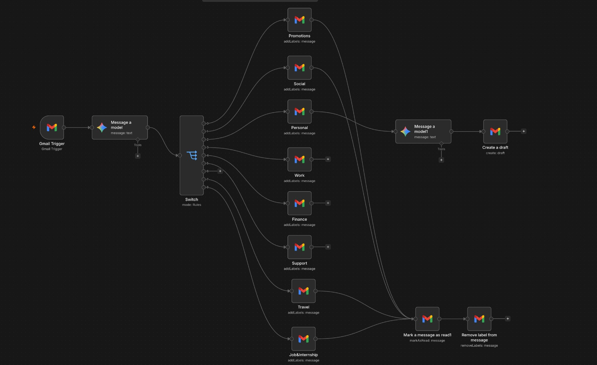
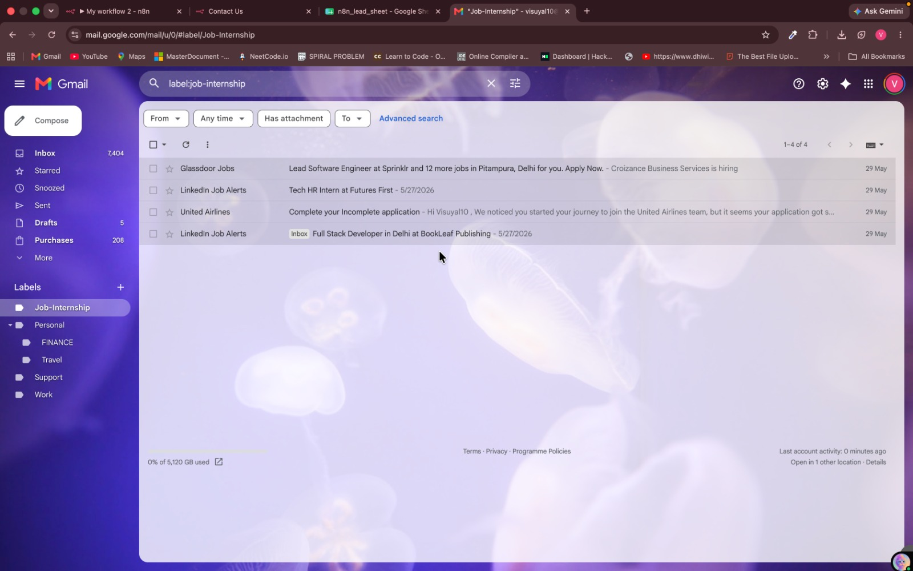
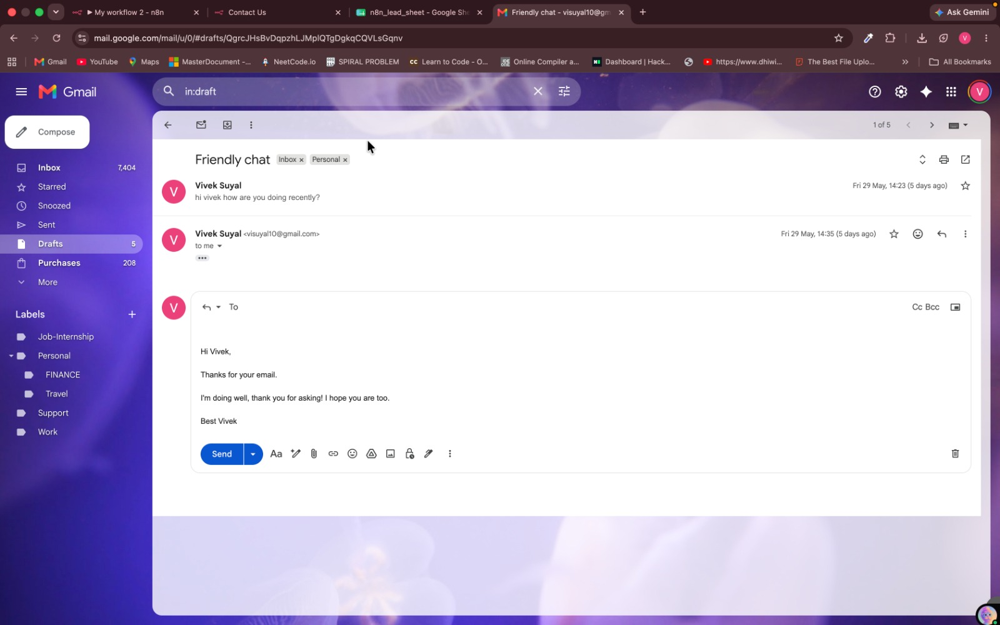

# AI Email Classifier & Response Assistant

An n8n workflow that uses Google Gemini and Gmail automation to classify incoming emails, organize Gmail labels, archive selected messages, and create AI-generated draft replies for personal emails.

## Overview

This workflow helps keep a Gmail inbox organized automatically. It checks for new messages every hour, sends email context to Gemini for classification, routes each result through the correct category branch, and performs Gmail actions based on that category.

For emails classified as `Personal`, the workflow generates a polished draft reply and keeps it attached to the original Gmail thread. The reply is saved as a draft, so it can be reviewed before sending.

## Features

- Classifies Gmail messages with Gemini 2.5 Pro
- Supports 9 practical email categories
- Applies Gmail labels automatically
- Marks processed messages as read
- Removes selected emails from the Inbox
- Generates contextual draft replies for personal emails
- Creates replies inside the original Gmail thread

## Email Categories

- Jobs & Internships
- Work
- Personal
- Finance
- Support
- Travel
- Updates
- Social
- Promotions

## Workflow Steps

1. Gmail Trigger checks for new emails every hour.
2. Gemini 2.5 Pro analyzes the sender, subject, and email body.
3. The AI returns exactly one email category.
4. A Switch node routes the email to the matching label branch.
5. Gmail nodes apply the correct label.
6. Selected emails are marked as read and removed from the Inbox.
7. Personal emails are sent to Gemini 2.5 Flash for reply generation.
8. A Gmail draft reply is created in the same email thread.

## Tech Stack

- n8n
- Gmail Trigger node
- Gmail API
- Google Gemini 2.5 Pro
- Google Gemini 2.5 Flash
- n8n LangChain Google Gemini node

## Screenshots

### Workflow



### Gmail Labels



### Generated Draft Example



## Project Structure

```text
ai-email-classifier-assistant/
├── My workflow 2.json
├── README.MD
└── screenshots/
    ├── draft.png
    ├── gmail-labels.png
    └── workflow.png
```

## Setup

1. Import `My workflow 2.json` into n8n.
2. Connect your Gmail OAuth2 credentials in every Gmail node.
3. Connect your Google Gemini credentials in both Gemini nodes.
4. Create or map Gmail labels for each category.
5. Replace imported Gmail label IDs with labels from your own Gmail account.
6. Review the Gemini classification prompt and reply prompt.
7. Update the draft reply sign-off name if needed.
8. Test the workflow with a small number of emails.
9. Activate the workflow.

## Important Notes

- The Gmail Trigger currently polls every hour.
- The trigger currently fetches up to 2 emails per run.
- Draft replies are created only for emails classified as `Personal`.
- AI-generated drafts should be reviewed before sending.
- Gmail label IDs are account-specific and may need to be replaced after import.
- Email content is sent to Google Gemini for classification and reply generation.

## Use Cases

- Job seekers tracking recruiter and application emails
- Busy professionals organizing high-volume inboxes
- Students managing academic, internship, and personal messages
- Freelancers separating client, finance, and support emails
- Anyone who wants AI-assisted email triage without auto-sending replies

## Privacy

This workflow processes email metadata and message content through Gmail and Google Gemini. Use your own credentials, review account permissions, and confirm the workflow matches your privacy requirements before activating it.

## Author

Vivek Suyal
