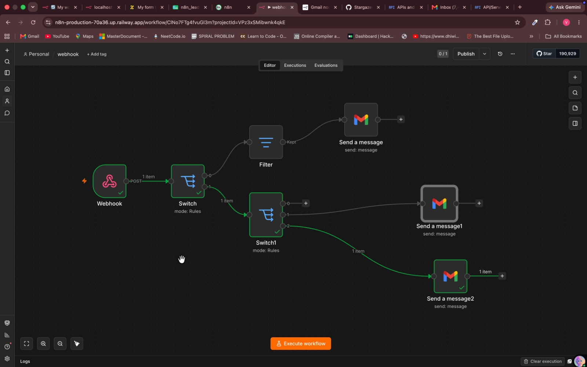
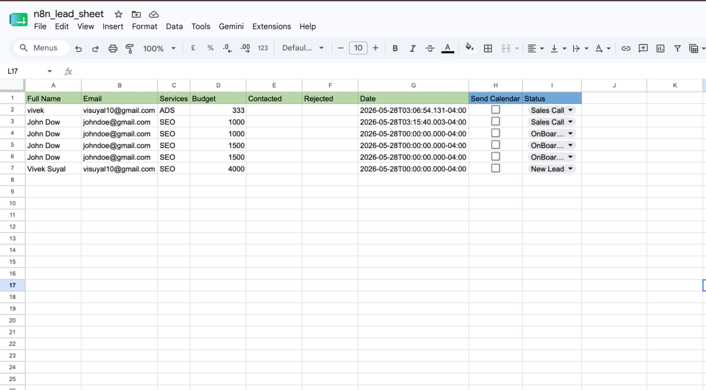

# Client Onboarding Automation

An n8n workflow that listens for Google Sheets webhook events, routes client status updates, and sends Gmail messages for meeting links, onboarding forms, and new-lead welcome emails.

## Overview

This workflow is designed for a client onboarding sheet where each row represents a prospect or client. When a tracked cell is updated, the webhook receives the row data, checks which column changed, and sends the appropriate email based on the value in that update.

The workflow currently uses the contact name and email address from the row values, then sends simple Gmail messages for onboarding milestones.

## Features

- Receives POST webhook events from a Google Sheets automation
- Detects updates in specific sheet columns
- Sends a meeting-link email when the meeting checkbox/value is marked `TRUE`
- Routes client stage values such as `OnBoarding` and `New Lead`
- Sends onboarding form emails to clients
- Sends welcome emails for new leads
- Uses row data from the webhook payload for personalized messages

## Expected Sheet Data

The workflow expects the webhook payload to include row values similar to:

- Client name in `rowValues[0]['0']`
- Client email in `rowValues[0]['1']`
- Edited column information in `body.range.columnStart`
- Edited value in `body.value`

## Current Routing

- Column `8` with value `TRUE` sends a `Meeting Link` email.
- Column `9` with value `OnBoarding` sends an `Onboarding form` email.
- Column `9` with value `New Lead` sends a `Welcome email`.
- Column `9` with value `Sales Call` is detected by the Switch node but currently has no connected email action.

## Workflow Steps

1. A Google Sheets automation sends a POST request to the n8n Webhook node.
2. The first Switch node checks which sheet column was edited.
3. If column `8` was edited, a Filter node confirms the value is `TRUE`.
4. Qualified column `8` updates send a meeting-link email through Gmail.
5. If column `9` was edited, a second Switch node checks the stage value.
6. `OnBoarding` updates send an onboarding form email.
7. `New Lead` updates send a welcome email.
8. `Sales Call` updates are recognized but do not currently trigger a follow-up node.

## Tech Stack

- n8n
- Webhook Trigger
- Switch node
- Filter node
- Gmail API
- Google Sheets webhook or Apps Script automation

## Screenshots

### Workflow



### Client Sheet



## Project Structure

```text
client-onboarding-automation/
├── webhook.json
├── README.MD
└── screenshots/
    ├── sheets.png
    └── workflow.png
```

## Setup

1. Import `webhook.json` into n8n.
2. Connect your Gmail OAuth2 credentials in each Gmail node.
3. Create or select the Google Sheet that will track client onboarding.
4. Configure your Google Sheets automation or Apps Script to send POST requests to the n8n webhook URL.
5. Make sure the webhook payload includes the edited range, edited value, and row values.
6. Update the Gmail message copy with your meeting link, onboarding form link, brand voice, and support details.
7. Review the column numbers used by the Switch nodes and adjust them if your sheet layout is different.
8. Add an action for the `Sales Call` route if you want that status to send an email.
9. Test each sheet update path before activating the workflow.

## Important Notes

- The webhook path is imported from the workflow and may need to be regenerated or replaced in your n8n instance.
- Gmail credentials are not included and must be configured after import.
- The meeting-link and onboarding-form email bodies currently contain placeholder-style copy and should be customized.
- Column indexes are based on the incoming webhook payload, so confirm they match your Google Sheets automation.
- The workflow depends on the webhook payload shape; changes to the sheet automation may require expression updates.

## Use Cases

- Agencies onboarding new clients from a shared sheet
- Freelancers sending next-step emails after sales updates
- Service businesses tracking prospect-to-client stages
- Teams automating client communication from Google Sheets
- Lightweight CRM workflows without a dedicated CRM platform

## Author

Vivek Suyal
