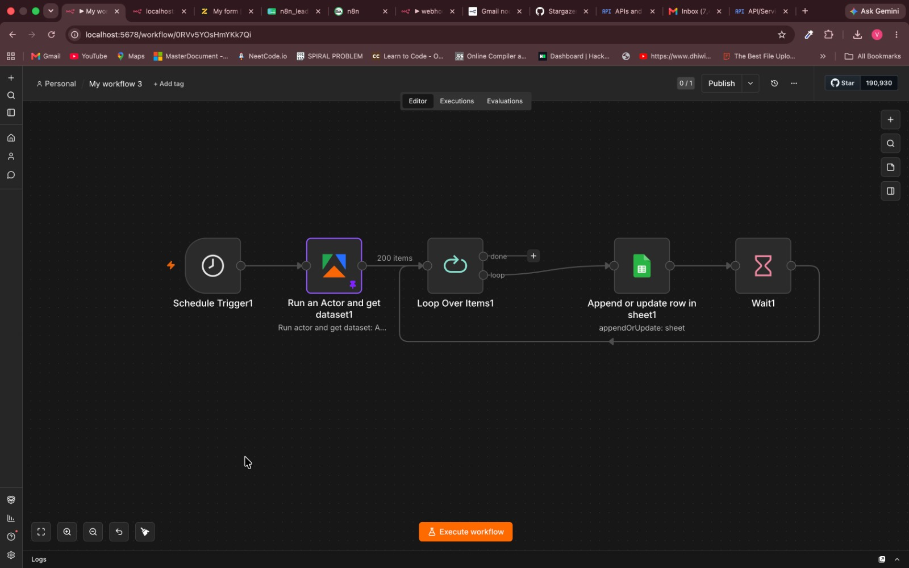
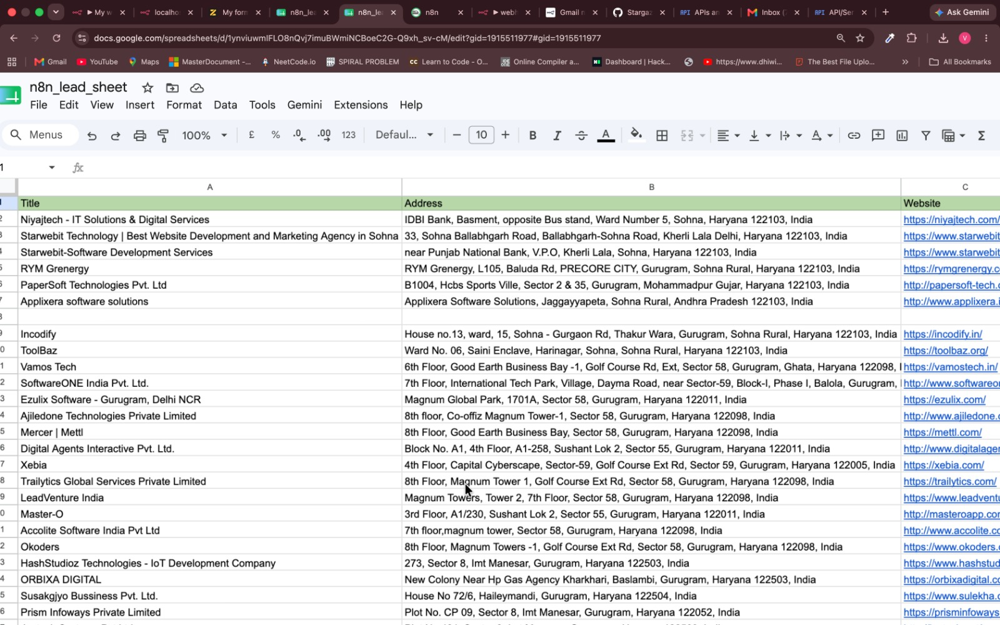

# Job Market Automation

An n8n workflow that automates job and company discovery using Apify scrapers, stores results in Google Sheets, and sends a Gmail summary for high-budget leads.

## Overview

This workflow is designed to support job search and market research automation. It can run on a schedule, collect company data from Google Maps, collect job listings from Indeed, and save both datasets into separate Google Sheet tabs.

The workflow also includes a lead-processing branch that filters sample leads by budget, sorts the qualified leads from highest to lowest budget, converts them into a readable digest, and emails the result through Gmail.

## Features

- Runs manually or on a schedule
- Scrapes Google Maps business data through Apify
- Scrapes Indeed job listings through Apify
- Saves company data to Google Sheets
- Saves job listings to Google Sheets
- Uses append-or-update logic to reduce duplicate records
- Filters leads by budget
- Sends a Gmail digest of qualified leads

## Data Sources

- Google Maps Scraper through Apify
- Indeed Scraper through Apify
- Manual/sample lead data inside n8n Set nodes

## Current Search Configuration

### Google Maps

- Search term: `software company`
- Location: `Gurugram, INDIA`
- Maximum places per search: `30`
- Stored fields:
  - Title
  - Address
  - Website
  - Phone Number
  - Rating
  - Reviews Count

### Indeed

- Country: `IN`
- Locations: `Gurugram`, `New Delhi`, `Noida`
- Positions:
  - Frontend developer
  - Backend developer
  - Generative AI
- Maximum items per search: `200`
- Stored fields:
  - Company
  - Position
  - Location
  - Apply-link
  - Company-Url

## Workflow Steps

1. Schedule Trigger starts the Google Maps scraper.
2. Apify runs the Google Maps actor and returns the dataset.
3. Loop Over Items processes each company result.
4. Google Sheets appends or updates company rows using `Website` as the matching column.
5. Wait loops the workflow back through the remaining company items.
6. A second Schedule Trigger starts the Indeed scraper.
7. Apify runs the Indeed actor and returns job listings.
8. Loop Over Items processes each job listing.
9. Google Sheets appends or updates job rows using `Company-Url` as the matching column.
10. The manual lead branch can split, filter, sort, aggregate, and email qualified leads.

## Tech Stack

- n8n
- Apify
- Apify Google Maps Scraper
- Apify Indeed Scraper
- Google Sheets
- Gmail API
- JavaScript Code nodes
- Schedule Trigger nodes

## Screenshots

### Workflow



### Jobs Sheet



## Project Structure

```text
job-market-automation/
├── My workflow 3.json
├── README.MD
└── screenshots/
    ├── jobs-sheet.png
    └── workflow.png
```

## Setup

1. Import `My workflow 3.json` into n8n.
2. Connect your Apify credentials.
3. Connect your Google Sheets credentials.
4. Connect your Gmail OAuth2 credentials if you plan to use the lead digest branch.
5. Create or select a Google Sheet with separate tabs for companies, jobs, and leads.
6. Replace the imported Google Sheet document ID and sheet IDs with your own.
7. Review the Google Maps search location and search term.
8. Review the Indeed locations, country, and position keywords.
9. Update the Gmail recipient for lead digest emails.
10. Test each branch manually before activating the schedule triggers.

## Important Notes

- The imported Google Sheet IDs are account-specific and should be replaced.
- Apify actor IDs and input payloads should be reviewed before running.
- The Google Maps branch matches existing rows by `Website`.
- The Indeed branch matches existing rows by `Company-Url`.
- The workflow currently searches Indian job markets around Gurugram, New Delhi, and Noida.
- Scraping usage may consume Apify credits depending on your account and actor settings.
- The lead digest branch contains sample lead data and should be replaced with your real lead source if used.

## Use Cases

- Job seekers tracking software roles in target cities
- Recruiters monitoring hiring activity
- Freelancers finding local software companies
- Agencies building prospect lists from Google Maps
- Students and developers collecting job application links

## Author

Vivek Suyal
