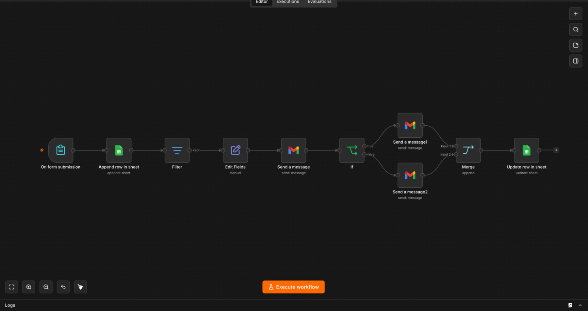
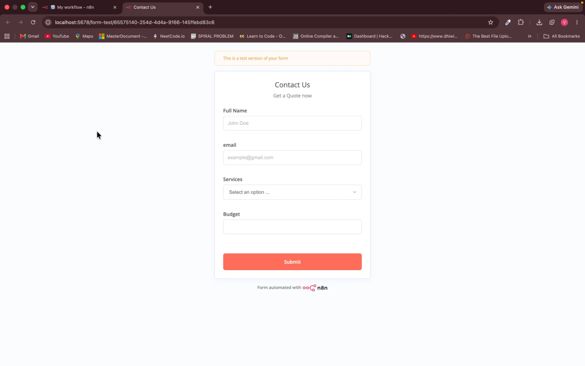
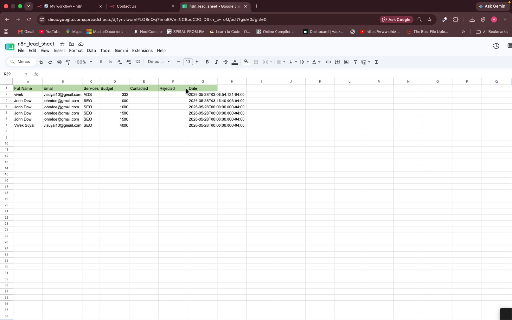

# Lead Management Automation

An n8n workflow that captures leads from a contact form, stores them in Google Sheets, qualifies them by budget, sends Gmail notifications, sends service-specific follow-up emails, and updates lead status in the sheet.

## Overview

This workflow is designed for a service-based business that wants to automate the first stage of lead handling. A prospect submits a form, the lead is saved to a Google Sheet, qualified based on budget, and followed up with a relevant email depending on the selected service.

The workflow currently supports `SEO` and `ADS` service inquiries.

## Features

- Captures leads with an n8n form
- Stores lead details in Google Sheets
- Qualifies leads using a budget threshold
- Sends an internal Gmail notification for qualified leads
- Sends personalized follow-up emails to prospects
- Routes follow-ups based on selected service
- Updates contacted and rejected status in Google Sheets

## Form Fields

- Full Name
- Email
- Services
  - SEO
  - ADS
- Budget

## Workflow Steps

1. A user submits the `Contact Us` form.
2. The lead is appended to a Google Sheet.
3. The workflow checks whether the lead budget is at least `1500`.
4. Qualified leads trigger an internal Gmail notification.
5. An If node checks whether the selected service is `SEO`.
6. SEO leads receive an SEO follow-up email.
7. ADS leads receive an ADS follow-up email.
8. The branches merge after follow-up.
9. The Google Sheet row is updated with contacted and rejected status.

## Google Sheet Columns

- Full Name
- Email
- Services
- Budget
- Contacted
- Rejected
- Date

## Tech Stack

- n8n
- n8n Form Trigger
- Google Sheets
- Gmail API
- Filter node
- If node
- Merge node

## Screenshots

### Workflow



### Contact Form



### Lead Database



## Project Structure

```text
lead-management-automation/
├── My workflow.json
├── README.MD
└── screenshots/
    ├── form.png
    ├── sheets.png
    └── workflow.png
```

## Setup

1. Import `My workflow.json` into n8n.
2. Connect your Google Sheets credentials.
3. Connect your Gmail OAuth2 credentials.
4. Create or select a Google Sheet with the required columns.
5. Replace the imported Google Sheet document ID with your own sheet.
6. Update the internal notification recipient email.
7. Review and customize the SEO and ADS follow-up email templates.
8. Update the appointment link in the follow-up messages.
9. Test the form submission flow.
10. Activate the workflow.

## Important Notes

- The qualification filter currently checks for budget greater than or equal to `1500`.
- The sheet update node marks `Contacted` as `TRUE` after follow-up.
- The rejected status uses a separate budget check in the update step.
- Imported Google Sheet IDs and Gmail recipients should be replaced before use.
- Email templates currently reference Canonball Media and should be customized for your own business.

## Use Cases

- Marketing agencies collecting SEO and ads leads
- Freelancers handling service inquiries
- Small businesses automating lead follow-up
- Sales teams tracking qualified prospects
- Digital agencies managing quote requests

## Author

Vivek Suyal
