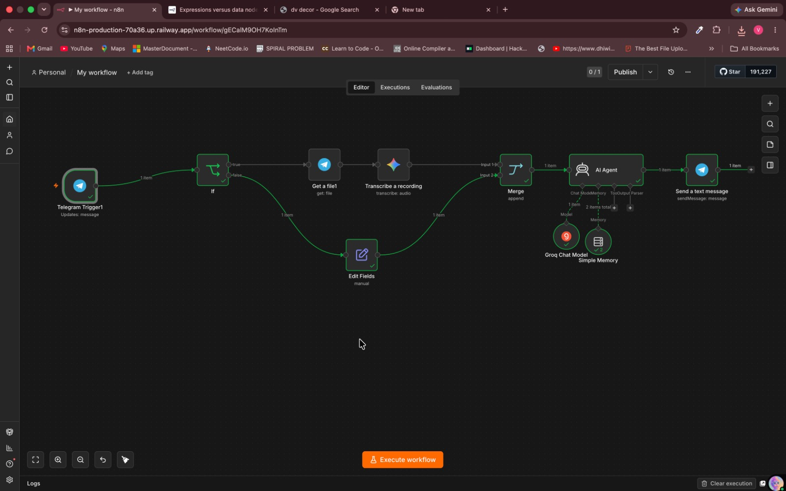

# Telegram AI Assistant

An n8n workflow that turns Telegram into a lightweight AI assistant for text, voice notes, and receipt/PDF thumbnail extraction using Google Gemini, Groq, and n8n LangChain memory.

## Overview

This workflow listens for Telegram messages and routes them into two assistant experiences. The chat branch accepts text messages and voice notes, converts voice input to text with Gemini, sends the message to an AI Agent powered by Groq, and replies back in the same Telegram chat.

The file-analysis branch downloads Telegram document attachments, checks the document MIME type, analyzes the available binary image input with Gemini, and asks Gemini to return extracted receipt line items in JSON format.

## Features

- Telegram message trigger for chat-based automation
- Text message support
- Voice note transcription with Gemini 2.5 Flash
- AI Agent responses using Groq `llama-3.1-8b-instant`
- Conversation memory keyed by Telegram chat ID
- Telegram reply delivery to the original chat
- PDF thumbnail analysis with Gemini 3 Flash preview
- Receipt line-item extraction request in JSON format

## Supported Inputs

- Telegram text messages
- Telegram voice messages
- Telegram document uploads with `application/pdf`

The workflow also contains an `image/jpeg` Switch rule, but that output is not connected in the imported workflow.

## Workflow Steps

### Chat and Voice Assistant

1. Telegram Trigger listens for incoming messages.
2. An If node checks whether the message contains a voice file.
3. Voice messages are downloaded from Telegram.
4. Gemini transcribes the voice recording.
5. Text messages are normalized into a `text` field.
6. The Merge node combines text and transcription paths.
7. The AI Agent receives the user message.
8. Simple Memory keeps the last 10 messages per Telegram chat.
9. Groq generates the assistant response.
10. Telegram sends the response back to the same chat.

### File and Receipt Extraction

1. Telegram Trigger listens for incoming file messages.
2. The workflow downloads the Telegram file thumbnail.
3. A Switch node checks the uploaded document MIME type.
4. The active `application/pdf` branch sends the binary image input to Gemini.
5. Gemini is prompted to extract receipt line items as JSON with amount, quantity, and description fields.

## Tech Stack

- n8n
- Telegram Bot API
- n8n Telegram Trigger node
- n8n Telegram node
- Google Gemini 2.5 Flash
- Google Gemini 3 Flash preview
- Groq `llama-3.1-8b-instant`
- n8n LangChain AI Agent
- n8n Simple Memory

## Screenshots

### Workflow



## Project Structure

```text
telegram-ai-assistant/
├── My workflow.json
├── README.MD
└── screenshots/
    └── workflow.png
```

## Setup

1. Import `My workflow.json` into n8n.
2. Create a Telegram bot with BotFather.
3. Connect your Telegram API credentials in both Telegram Trigger nodes and Telegram file/message nodes.
4. Connect your Google Gemini credentials in the file-analysis and audio transcription nodes.
5. Connect your Groq credentials in the Groq Chat Model node.
6. Review the AI Agent prompt behavior and model selection.
7. Review the receipt extraction prompt and adjust the output schema if needed.
8. Test with a Telegram text message, a voice note, and a receipt/PDF upload.
9. Activate the workflow.

## Important Notes

- The workflow uses two Telegram Trigger nodes, so confirm both are configured correctly after import.
- Simple Memory stores conversation context by Telegram chat ID with a context window of 10 messages.
- Voice notes are sent to Google Gemini for transcription.
- Chat responses are generated through Groq.
- Receipt/PDF thumbnail content is sent to Google Gemini for analysis.
- Imported credential IDs are placeholders from the original n8n instance and must be replaced with your own credentials.
- The file-analysis branch currently downloads the document thumbnail file ID. If you want full-resolution image or document processing, update the Telegram file node to use the main document file ID and connect any additional Switch outputs.

## Use Cases

- Personal Telegram AI assistant
- Voice-to-AI chat over Telegram
- Quick receipt or PDF thumbnail extraction
- Lightweight conversational bot with short-term memory
- Prototype for Telegram-based AI support flows

## Privacy

This workflow sends Telegram message content, voice recordings, and file thumbnail content to external AI providers. Review Telegram bot access, Google Gemini usage, Groq usage, and your data retention requirements before activating it.

## Author

Vivek Suyal
